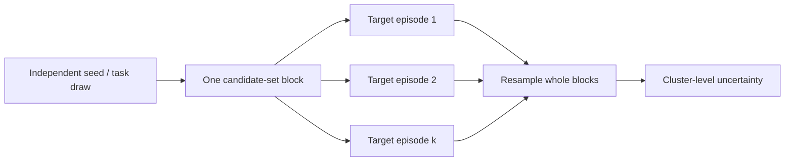

# Paired protocol comparison: sample-size sensitivity

**Status:** pre-data sensitivity analysis, generated by [`paired_mcnemar_power.py`](paired_mcnemar_power.py). No model outcomes were used to choose the scenarios or estimate nuisance parameters.

## Why the four-case pilot cannot rank protocols

For paired binary episode outcomes, the exact two-sided McNemar test conditions on the discordant pairs: episodes where exactly one of the two conditions succeeds. With four pairs, even the most favorable possible result (all four discordant and all favoring one condition) has exact two-sided `p = 2 / 2^4 = 0.125`. Therefore, a four-episode batch can establish execution feasibility, inspect traces, and reveal gross failure modes, but it cannot reject equality at the conventional 0.05 level. Repeating such batches does not change this unless the observations are pooled under a predeclared sampling and analysis plan.

## Sensitivity method

Let `p10` be the probability that protocol A succeeds while B fails, and `p01` the reverse. The paired risk difference is `Δ = p10 - p01`; the discordance probability is `q = p10 + p01`. Conditional on `D` discordant pairs, the exact null test uses `X | D ~ Binomial(D, 0.5)`. For planning under an alternative, `D ~ Binomial(N, q)` and `X | D ~ Binomial(D, p10/q)`. The script enumerates exact conditional rejection boundaries and computes unconditional power, then finds the smallest `N` reaching 80% power.

The scenarios below are assumptions, not estimates. The second family-wise column applies Bonferroni correction for six planned contrasts (`α = 0.05/6`). It is a conservative illustration; the final confirmatory family and multiplicity method must be frozen before outcomes are observed.

| Assumed risk difference Δ | Assumed discordance q | p10 / p01 | Pairs for 80% power, α=.05 | Pairs for 80% power, α=.05/6 |
|---:|---:|---:|---:|---:|
| 0.05 | 0.15 | .10 / .05 | 498 | 748 |
| 0.10 | 0.20 | .15 / .05 | 168 | 246 |
| 0.15 | 0.25 | .20 / .05 | 92 | 135 |
| 0.20 | 0.30 | .25 / .05 | 61 | 90 |

Each reported sample size is the smallest integer meeting 80% power in the enumerated calculation; the preceding integer is below target. The calculations assume independent sampled episode pairs and a fixed paired effect. That assumption does **not** match every current task runner. Emergent OOD v0.3 chooses one fixed candidate set per generation seed, then evaluates each member of that set once as target. Its five episode rows therefore form one balanced task block, not five independent draws. The current five-row evaluation has one independent block. The reported `N` values cannot be read as the number of OOD episode rows required: translating per-episode `(Δ,q)` into block-level power requires the joint within-block outcome distribution, which is unknown before a pilot. For that task, collect multiple independently sampled blocks, retain each complete block, and resample/analyze at the block level. Dependence, model sampling variability, multiple model families, missing calls, adaptive stopping, or a different confirmatory endpoint can change power and require a revised design.

## Implication for the project

Keep the current 4/5-case runs in the feasibility and capability-calibration role. Do not describe their format outcomes as evidence of stable superiority. First use small pilots to validate the task, endpoint behavior, paired scoring, and variance sources. Then estimate `q` from pilot data without selecting only favorable tasks; choose a practically meaningful `Δ`; freeze the number of contrasts, episode-generation process, stopping rule, and analysis; and collect a separate held-out confirmatory set. For target-balanced task blocks, the independent unit is the independently generated block, and a cluster-aware power analysis must replace the independent-episode table. If the likely effect is only five percentage points, the illustrative independent-episode sample sizes show that a credible claim may be expensive even on this small task family.

The analysis follows matched-pair power guidance emphasizing the discordance parameter (Lennox, [Statistics in Medicine, 2009](https://onlinelibrary.wiley.com/doi/10.1002/sim.3683)). Whole-cluster resampling preserves within-block dependence, but ordinary cluster-bootstrap intervals can still be unreliable with few independent clusters; Cameron and Miller note that "few" can range from below 20 to below 50 depending on the setting ([Journal of Human Resources, 2015](https://doi.org/10.3368/jhr.50.2.317)). The tool's fewer-than-20 flag is a warning only, not a sufficiency threshold. The need to guard against performance selection is also discussed in the companion [capability-gate audit](CAPABILITY_GATE_SELECTION_BIAS_AUDIT.md), with reference to Cawley and Talbot ([JMLR, 2010](https://www.jmlr.org/papers/v11/cawley10a.html)).
